<h1 align="center">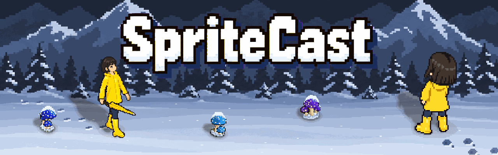</h1>

<p align="center"><b>일러스트 한 장이 게임 캐릭터가 돼요.</b><br>
Claude Code용 아이소메트릭 스프라이트 생성기: 8방향 걷기, 동작, 픽셀아트를<br>
내 게임의 카메라 각도로, 프레임마다 3D 그림자와 함께 만들어요. 옆에 놓을 소품도요.</p>

<p align="center"><a href="https://github.com/Sunghwan0112/spritecast/stargazers"></a></p>

<p align="center">
<a href="#만들-수-있는-것">만들 수 있는 것</a> ·
<a href="#걷는-캐릭터">캐릭터</a> ·
<a href="#픽셀아트-아케이드-크기">픽셀아트</a> ·
<a href="#소품과-배경">소품</a> ·
<a href="#설치">설치</a> ·
<a href="#자주-묻는-질문">자주 묻는 질문</a> ·
<a href="README.md">English</a> · <a href="README.zh-CN.md">简体中文</a> · <a href="README.ja.md">日本語</a> · <a href="README.es.md">Español</a> · <a href="README.pt-BR.md">Português</a>
</p>

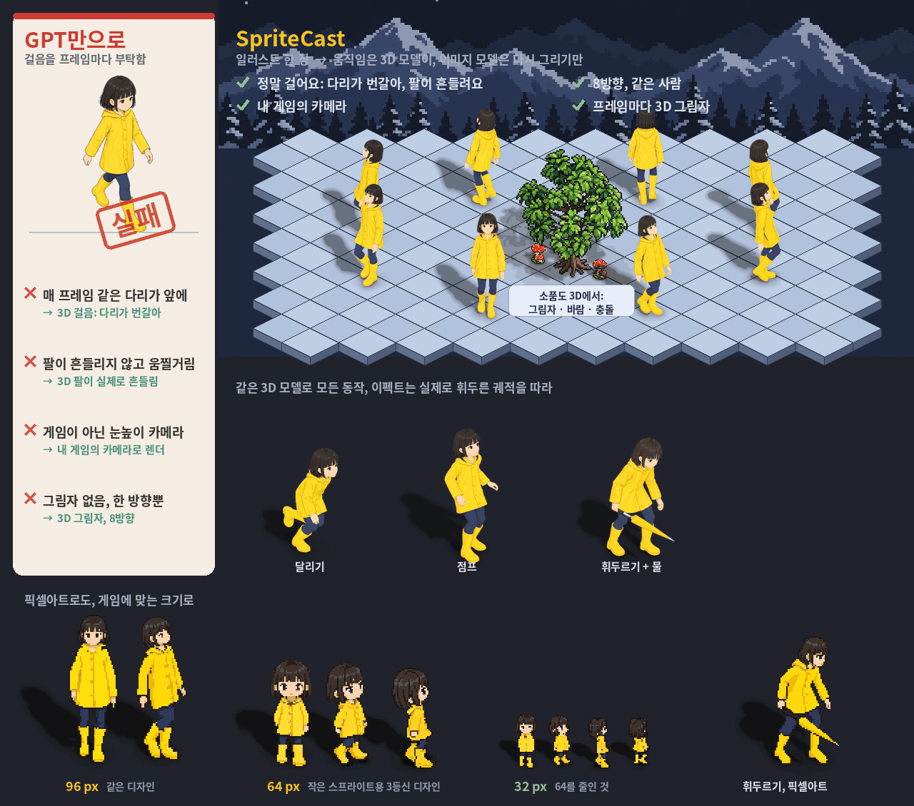

<p align="center"><i>같은 이미지 모델, 같은 캐릭터 시트. 왼쪽: GPT에 걸음을 부탁해서 나온 그대로. 오른쪽: 3D가 더해 주는 것.</i></p>

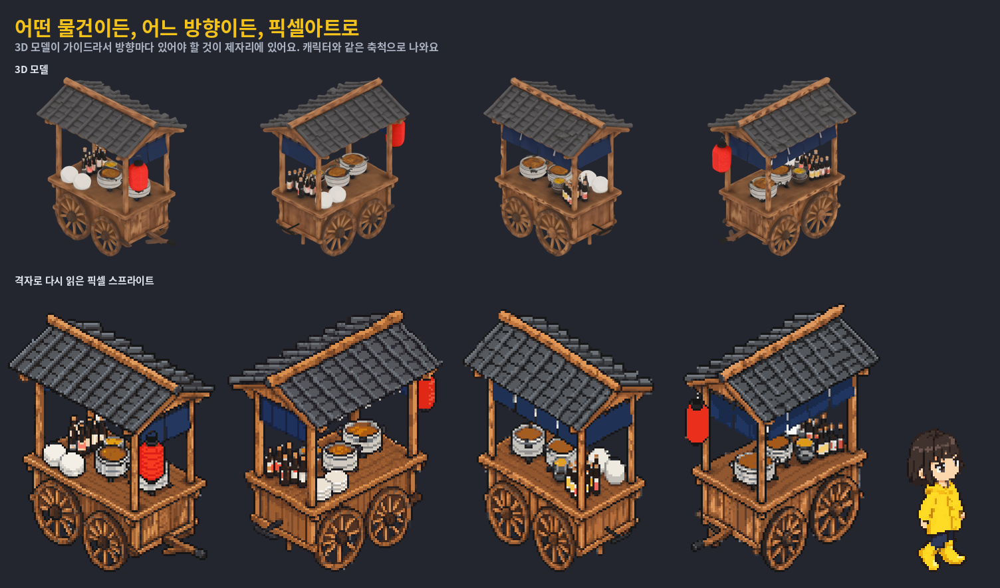

<p align="center"><i>사람만이 아니에요. 어떤 물건이든, 어느 방향이든, 캐릭터와 같은 축척의 픽셀아트로. <a href="#픽셀아트-소품-어떤-물건이든-어느-방향이든">방법</a>.</i></p>

```
claude plugin marketplace add Sunghwan0112/spritecast
claude plugin install spritecast@spritecast
```

그다음엔 부탁만 하면 돼요: *"내 캐릭터야(hero.png). 8방향으로 걷게 해 줘."*
**키 없이 무료로 해 보려면** Claude에게 *"SpriteCast 체험해 줘"*라고 하세요.

그림은 이미지 모델(OpenAI, 내 키로)이 그려요. 몸, 움직임, 각도, 그림자는 3D에서 나와요. 그래서 모든 프레임이 같은 사람이고,
정말로 걸어요.

| | 주는 것 | 받는 것 | 비용 |
|---|---|---|---|
| **걷는 캐릭터** | 일러스트 한 장 | 8방향 걷기, 서 있는 모습, 프레임마다 그림자 | 약 $2.2 + Tripo 75크레딧 |
| **동작 추가** | 동작 이름, 또는 Mixamo FBX | 달리기, 점프, 베기, 던지기... 8방향 | 동작마다 Tripo 약 10크레딧(FBX는 없음) + 그리기 |
| **픽셀아트** | 걷는 캐릭터 | 키 약 100px 픽셀 스프라이트 | 시트 한 장 약 $0.075 (8방향 걷기 약 $1.35) |
| **동물** | 일러스트 한 장 | 네발 걷기 8방향 | Tripo 30크레딧 + 그리기 |
| **앉기** | 걷는 캐릭터 | 8방향 앉은 모습, 내 소품 위에 앉히기 | 약 $0.22 |
| **소품, 포즈 잡은 NPC** | 설명 | 스프라이트, 그림자, 앵커 | 약 $0.07 (방향 추가마다 $0.08) |
| **픽셀아트 소품** | 설명 | 모든 방향의 픽셀 스프라이트, 픽셀 캐릭터와 같은 축척 | Tripo 약 20크레딧 + 방향마다 $0.08 |

무료, MIT. 비용은 OpenAI와 Tripo에 직접 내요. 돈이 드는 단계는 비용을 먼저 보여 주고 OK를 기다려요.

**그리는 비용 절반: 4방향.** 스펙에 `"facings": 4`를 넣으면 대각선 4방향(남동, 남서, 북동, 북서)만 그려요. 그리는 비용이
절반쯤이에요(걷기: ~$2 대신 ~$1, 픽셀 아트는 ~$1.35 대신 ~$0.7). 내보낸 캐릭터는 그대로 8방향으로 걸어요. 동쪽을 주면 그려진
방향 중 가장 가까운 것을 보여 주고 그대로 유지해서, 옆으로 곧게 걸어도 깜빡이지 않아요.

## 만들 수 있는 것

| | |
|---|---|
|  |  |
| **[8방향 걷기](#걷는-캐릭터)**: 일러스트 한 장에서, 프레임마다 그림자까지 | **[동작](#동작-추가-달리기-점프-베기)**: 달리기, 점프, 베기, 또는 Mixamo 클립 아무거나 |
|  |  |
| **[픽셀아트](#픽셀아트-아케이드-크기)**: 키 약 100px, 쥐고 던지는 물건까지 | **[네발 동물](#네발-동물)**: 리그를 사지 않고 |
|  |  |
| **[앉기](#앉기)**: 내 소품 위에, 앞을 가리는 팔걸이는 3D로 계산 | **[소품](#소품과-배경)**: 실제 크기로, 전부 한 바닥에 |
|  |  |
| **[3D 모델에서 구운 그림자](#light-shadow-wind)**: 해, 흐린 날, 또는 직접 놓는 조명 | **[나뭇잎의 바람](#light-shadow-wind)**: 같은 모델에서, 가지 단위로 |

## 이렇게 부탁해 보세요

- *"내 캐릭터야(hero.png). 8방향으로 걷게 해 줘."*
- *"달리기와 점프도 넣어 줘. 던지기도. Mixamo 클립(Throw.fbx) 줄게, 손에 눈덩이를 쥐여 줘."*
- *"우리 게임은 픽셀아트야. 걷기와 던지기를 키 96px쯤 되는 픽셀 스프라이트로 만들어 줘."*
- *"앉게 해 주고, 이 안락의자에 앉혀 줘."*
- *"상점 주인 NPC 만들어 줘. 갈색 카디건 입은 할아버지, 네 방향으로."* (포즈 잡은 인물: 설명만 있으면 돼요)
- *"아이소메트릭 책장 만들어 줘. 높이 1.8m, 책 가득, cozy 스타일로."*
- *"이건 우리 게임 소품이야(props/barrel.png). 같은 그림체로 나무 상자 만들어 줘."*

## 왜 되나요

이미지 모델은 프레임이 바뀌면 같은 몸과 자세를 유지하지 못해요. 걸음을 글로 부탁하면 예쁜 그림 여덟 장이 나오지만 걷지는
않아요. 맨 위 그림의 왼쪽이 그거예요. 나온 그대로 보여 줘요.

| GPT만으로 | SpriteCast |
|---|---|
| 여덟 프레임 모두 같은 다리가 앞에 | 다리는 3D 걸음에서 나와요 |
| 팔이 제멋대로 움찔거림 | 팔이 다리와 반대로 흔들려요 |
| 눈높이 카메라 | 내 게임의 카메라 (기본은 30° 내려다보기) |
| 그림자 없음 | 프레임마다 3D 몸의 그림자 |

그래서 SpriteCast는 그걸 맡기지 않아요. **움직임은 3D가 하고, 이미지 모델은** 렌더된 프레임을 내 일러스트의 그림체로 **다시
그리기만** 해요. 그린 그림은 전부 렌더 위에 다시 맞추고 렌더와 비교해요. 다른 자세로 그린 프레임은 억지로 맞추지 않고 표시해서
다시 그릴 수 있어요. 소품도 같은 방식이고, 리그 대신 실제 크기의 블록을 써요.

**그래서 좋은 점:**
- **각도와 크기가 맞아요.** 단단한 소품 예시는 가이드와 윤곽이 95–99% 겹쳐요. 일부러 잎을 자유롭게 그린 화분은 87%, 옷 입은
  인물은 69–88%예요(옷과 머리카락이 맨 마네킹 밖으로 나가요). 걷는 캐릭터는 프레임마다 점수를 매겨요(아래). 카메라와 축척이 고정이라
  다른 때에 만든 소품도 한 바닥에 맞아요.
- **그림자가 자연스러워요.** 모든 소품이 빛 하나를 함께 써서 그림자가 같은 방향으로 떨어져요. 단단한 소품은 3D 가이드의 그림자를
  그대로 받아요. 포즈 잡은 인물과 식물은 그림 모양 그대로의 그림자(모자, 머리카락, 잎)를 받는데, 위치는 3D 모델이 정해서 발과 화분
  바닥이 선 자리에서 그림자가 시작해요. 걷는 캐릭터는 프레임마다 3D 몸의 그림자를 받아요. 대충 칠한 그림자도, 각진 마네킹 그림자도
  아니에요.
- **스스로 검사해요.** 그린 뒤 가이드와 비교해서, 모델이 다른 각도로 그렸으면 억지로 늘리거나 줄이지 않아요. 대신 경고를 띄우고, Claude가
  고칠 방법을 제안한 뒤 다시 그릴지 물어봐요.
- **내 게임 시점, 내 그림체.** 2:1 아이소메트릭, 정아이소메트릭, 3/4 탑다운, 정면, 아무 각도. 한 물건의 네 방향. 기본 `cozy` 스타일이나
  내 그림 한 장.
- **빛이 어긋나지 않아요.** 모든 가이드가 화면에 고정된 같은 해를 받고, 이미지 모델은 그 렌더 위에 그려요. 그래서 물체의 밝은 면과
  어두운 면이 3D 모양에서 나오고, 모든 소품의 모든 면이 같은 쪽에서 빛을 받아요. 손으로 칠한 음영은 없어요
  ([게임에서 보기](#만든-게임-우비소녀의-여행)).

## 만든 게임: 우비소녀의 여행

<p align="center"><a href="https://sunghwan0112.github.io/rain-girl/"></a></p>

<p align="center"><a href="https://sunghwan0112.github.io/rain-girl/"><b>▶ 브라우저에서 바로 플레이</b></a> &nbsp;·&nbsp; <a href="https://github.com/Sunghwan0112/rain-girl">게임 코드</a><br>설치도 가입도 필요 없어요. 점수를 올리면 아래 랭킹에 나와요.</p>

<p align="center"><a href="https://sunghwan0112.github.io/rain-girl/"></a></p>

<p align="center"><i>우비소녀의 여행 · Rain Girl. 노란 우비를 입은 소녀가 우산의 물로 불꽃 몬스터를 꺼서 숲이 타기 전에 지키는 작은 픽셀 액션
게임이에요. 소녀와 모든 소품이 SpriteCast로 만들어졌어요.</i></p>

- **소녀.** 일러스트 한 장 → Tripo 모델에 뼈대를 넣고 게임 카메라(2:1, 30° 내려다봄)로 렌더 → 우산 들고 걷기, 휘두르기, 서 있기를 대각선
  네 방향(`"facings": 4`)으로, 프레임마다 96px 픽셀 아트로 다시 그렸어요. 휘두를 때 뿌리는 물은 3D로 렌더한 효과를 같은 방식으로 그린
  것이고, 서 있는 동작은 `idleclip.py`예요.
- **숲.** 나무, 반쯤 탄 나무, 다 탄 나무, 덤불, 탄 그루터기, 바위, 버섯 - 소품 일곱 개를 각각 Tripo 모델로 만들어 소녀와 같은 크기
  (1m에 74px: 2.4m 나무가 약 175px)로 네 면에서 렌더하고 픽셀 아트로 그렸어요. 스프라이트 28개. 게임은 소품마다 한 면을 무작위로
  보여 주고, 불탄 나무는 서 있던 면 그대로 반쯤 탄 나무, 다 탄 나무로 바뀌어요.
- **빛은 하나, 손으로 칠한 음영은 없음.** 28개 모두 3D 가이드처럼 오른쪽 위에서 빛을 받아요. 아래는 모든 소품의 모든 면이에요.

<details><summary>게임 풀밭 위의 소품 스프라이트 28개</summary>


</details>

- **콤보.** 같은 세트의 Mixamo 동작 두 개(내려치기, 돌려 베기)를 리그에 옮기고, 도끼질을 원호를 그리는 칼 베기로 바꾸고, 두 번째가
  첫 번째의 마지막 자세에서 시작하게 이었어요(`motion.py`). 네 방향 픽셀 아트로 그렸고, 물은 소녀 키의 두 배 거리에서 서서히 사라져요.
  내려치는 중에 한 번 더 누르면 돌려 베기가 이어지고, 닿는 범위만 한 고리가 소녀를 감싸요.
- **이펙트.** 맞을 때, 불이 꺼질 때, 날아오는 불덩이와 막힐 때, 아이템을 먹을 때, 돌려 베기의 고리는
  [PVFX Foundry](https://nerijs.itch.io/pvfx-foundry)(CC0)의 이펙트예요. 이제 SpriteCast에 253개가 같이 들어 있고, `fxpack.py`로 찾아서
  우리 스프라이트 크기와 색으로 내보낼 수 있어요. 소녀를 감싸는 고리는 가운데에서 잘라 먼 쪽은 몸 뒤, 가까운 쪽은 몸 앞에 그려요.


<details><summary>SpriteCast에 같이 들어 있는 이펙트 253개 중 32개</summary>

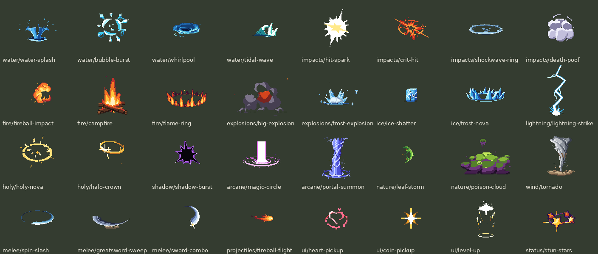

</details>

- **팔레트도 하나.** 다 만든 뒤 소품과 풀밭 타일을 48색 팔레트 하나로 맞췄어요(755색에서). 나무의 초록과 덤불의 초록이 같은 초록이에요.
- **3D는 게임 안에서도 쓰여요.** 땅의 그림자는 각 소품의 모델에서 구웠고([방법](#light-shadow-wind)), 소녀는 소품 그늘에 들어가면 어두워져요 - 발, 허리, 머리가
  각자 해와의 사이에 무엇이 있는지만큼. 불꽃이 어디서 엄폐물에 막히는지는 각 소품의 모델을 불꽃 높이(0.55m)에서 잘라, 지금 보이는 면에
  맞춰 정해요. 줄기는 막고, 그 위 나뭇잎은 안 막고, 버섯은 너무 낮아요.
- **바람도 모델에서 나와요.** 나뭇잎을 3D 모델 위의 위치대로 뭉치로 나누고, 뭉치마다 통째로 1px씩 움직여요. 그래서 나무가 가지
  단위로 흔들려요 - 라운드의 바람 쪽으로, 돌풍에는 더 세게([방법](#light-shadow-wind)).
- **소품 하나의 비용:** 모델에 Tripo 약 20크레딧, 네 면 그리기에 약 $0.3.

## 걷는 캐릭터

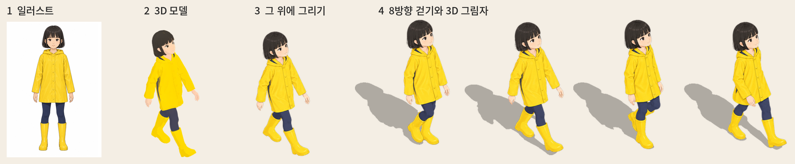

캐릭터 일러스트 한 장(정면을 보고 똑바로 선, 포즈 없는 그림)을 주면 그 그림체로 8방향 걷기(방향마다 8프레임)와 서 있는 8방향이 나와요. 이미지 모델은 프레임마다 몸과 자세를
일정하게 유지하지 못해서, 움직임은 3D에서 가져와요.
1. 일러스트로 턴어라운드를 그려요.
2. [Tripo](https://www.tripo3d.ai)가 턴어라운드로 3D 모델을 만들고, 리그를 달고, 걷기와 서 있기 동작을 입혀요.
3. 게임 카메라로 걷기를 렌더해요(무료). 프레임마다 3D 몸을 빛 방향으로 바닥에 눌러 붙인 그림자도 같이 렌더해요.
4. 이미지 모델이 렌더 위에 4프레임씩 그려요. 정면을 먼저 그리고 다른 방향은 모두 그걸 따라 그려서 같은 사람으로 유지돼요.
5. 각 프레임을 렌더에 다시 맞추고, 머리 크기를 고르게 하고, 가장자리를 정리해요. 결과는 스트립, 프레임마다 그림자(발이 그림자에
   닿고, 든 발은 따로 그림자가 생겨요), 앵커예요.

```
$PYTHON skills/spritecast/scripts/charpipe.py turnaround hero.json --yes   # 그다음 3d(모델, 리그, 렌더), draw(마무리, 미리보기까지 저절로)
```
기본으로 8방향을 다 그려요. 좌우가 같은 디자인은 `"mirror": true`로 서쪽 방향들을 동쪽에서 뒤집어 만들 수 있어요(그림자는 방향마다
자기 렌더에서). 약 $0.66 덜 들어요.
또는 `"facings": 4`: 대각선 4방향만 그리고, 비용은 절반쯤이에요. 내보낸 캐릭터는 8방향 어디로 가든 그중 가장 가까운 방향을 보여 줘요.

캐릭터 하나에 약 $2.2(OpenAI, `"mirror": true`면 약 $1.5), Tripo 75크레딧(약 $0.75, 동물은 30)이 들어요. 리그된 GLB가
있으면(`"rig_glb"`) 바로 `render`부터 하면 돼요.

<details>
<summary><b>더 보기: 미리보기 영상, Meshy, 예시 캐릭터와 리그</b></summary>

`preview`는 `walk-all.mp4`(8방향이 한꺼번에 걷는 영상, ffmpeg가 있으면)도 만들어요. 머리가 커졌다 작아지거나 프레임이 튀는 게 가장 빨리
보여요. Tripo는 가끔 모델을 옆으로 돌려서, 또는 색 없이 보내는데 둘 다 자동으로 고쳐요. `"modeler": "meshy"`(와 `MESHY_API_KEY`)를
주면 [Meshy](https://www.meshy.ai)가 모델을 만들고(약 30 Meshy 크레딧), 리그는 그대로 Tripo가 해요.

다른 옵션(같은 사람의 여러 옷, 신발 바닥에 앵커 두기)과 요령은 [reference/character.md](skills/spritecast/reference/character.md)에
있어요. 위 여자아이 예시는 [`examples/rain_girl`](examples/rain_girl)에 있어요(일러스트, 턴어라운드, 사양, 스트립, 그림자, `character.json`, 전체 시트).

Tripo만으로 만들었고 그리기 약 $1.7, Tripo 85크레딧이 들었어요. 리그를 단 3D 모델(`rig.glb`, 걷기·달리기·점프·베기 포함, 저장소의 나머지처럼 MIT)도 있어서, 키도 비용도 없이 3D 쪽 전체를 해 볼 수
있어요. 폴더를 복사해 사양에 `"draw": false`를 넣고 `charpipe.py render rain_girl.json`, 이어서 `finish`를 돌리면 3D 모델 그대로
스트립, 그림자, 앵커가 나와요. 사양의 `"notes"` 쓰임새도 볼 수 있어요. 3D 렌더에는 비옷 옆선과 팔 안쪽에 검은 줄이 생겼는데,
`notes`에 한 줄("어디에도 어두운 선, 줄, 솔기 없음... 빼라")을 넣었더니 모든 프레임에서 그 줄을 빼고 그렸어요. 모델의 결함을 3D가
아니라 그리는 단계에서 고친 거예요.

</details>

### 네발 동물

Tripo의 네발 동물 리그는 걸음이 어색해요(등뼈가 없고, 어깨가 목에 매달려 있어요). 그래서 동물은 리그를 사지 않아요.
`"kind": "animal"`을 쓰면 3D 모델(Tripo, 약 30크레딧)만 있으면 돼요. 뼈대(발, 등, 머리, 꼬리, 보는 방향)를 모델 모양에서 찾고,
고양이나 개의 걸음으로 걷고, 그리기, 맞추기, 3D 그림자는 사람과 같아요.

턴어라운드는 네 다리로 서서 다리가 서로 겹치지 않게, 꼬리는 뒤로 빼서 그려요. 옷은 몸에 붙는 것만(니트 조끼는 되고, 망토나 목도리는
안 돼요 - 늘어진 건 가까운 다리를 따라 움직여요). 그리기 전에 렌더를 확인하세요: 다리 넷, 머리는 앞, 꼬리는 뒤. Tripo 모델에 다리가
하나 더 생기면 다시 만들거나 Meshy(`"modeler": "meshy"`)로 만들어요.

<details><summary>노란 비옷을 입은 치즈 고양이의 8방향 걷기</summary>


</details>

고양이는 [`examples/tabby_cat`](examples/tabby_cat)에 있어요. 여자아이와 같은 노란 비옷을 입은 치즈 고양이예요(디자인, 턴어라운드, 사양,
스트립, 그림자, 시트). Tripo 30크레딧, 다시 그리기와 디자인 시도까지 그리기 약 $2.5가 들었어요. 프레임은 렌더와 0.76-0.97로
맞아요(north-east와 north-west는 `"mix"`로 프레임마다 섞었어요. reference/character.md 참고).

### 동작 추가: 달리기, 점프, 베기

걷기 말고도 달리기, 점프, 무언가를 휘두르는 동작을 만들 수 있어요. 설계도에 `"actions": ["run", "jump", {"name": "slash", "hold":
"umbrella"}]`처럼 적으면, 리깅할 때 Tripo에서 그 동작들을 받고(동작 하나에 약 10크레딧. 달리기, 점프, 베기, 쏘기, 뛰어들기, 오르기,
떨어지기, 맞기, 돌기가 있어요) 걷기처럼 8방향으로 렌더하고 그려서 동작마다 스트립과 프레임별 그림자를 만들어요. 베기처럼 손에
무언가가 필요하면 `"hold"`가 간단한 도형으로 물건을 만들어 손에 쥐여 줘서 모든 프레임에서 함께 움직여요(지금은 우산, 권총, 물총. 기본은 오른손이고 `"hand": "left"`면 왼손).
직접 리깅한 모델이면 그 안의 어떤 클립이든 동작으로 쓸 수 있어요. 쥔 물건은 이미지 모델에 부분별로 설명해요.
특히 손에 가까운 쪽(손잡이, 대의 첫 부분)을 가장 꼼꼼히 적어요. 작고 몸에 붙어 있어서, 그냥 두면 모델이 짐작으로 그리는 곳이거든요.


**대부분 한 번에 나와요.** 비옷 소녀의 걷기, 달리기, 점프는 모두 한 번 그려서 모든 프레임이 3D 렌더와 0.78 이상 맞았어요. 우산 베기는
조금 더 까다로워요(가늘고 긴 물건이 몸 주위를 돌아요). 무기가 엉뚱한 곳에 그려지면 알아서 다시 그리고, 남는 건 허리를 깊이 숙이는
칸에서 몸을 조금 덜 숙여 그린 정도라 움직일 때는 자연스러워요. 그런 프레임은 목록으로 알려 주니 보고 두거나 다시 그리면 돼요.

**항상 들고 다니는 물건, 어느 손이든**(요청이 있었어요). `"hold"`를 동작 하나가 아니라 설계도 자체에 적으면
(`"hold": {"kind": "watergun", "hand": "left"}`) 걷기, 서 있는 자세, 모든 동작에서 들고 있어요.
아래는 왼손에 든 물총이에요. 위가 3D 가이드, 아래가 그린 프레임이에요.

<details><summary>왼손에 든 물총</summary>

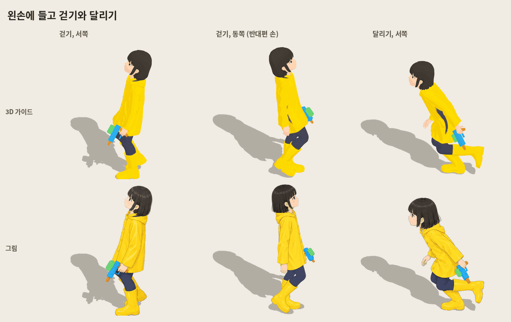

</details>

- **그 손에 그대로 있어요.** 한 손에 물건을 든 캐릭터는 좌우가 같지 않아요. 그래서 다른 프레임을 뒤집어 만드는 일이 전혀 없어요.
  뒤집으면 물건이 반대 손으로 가니까요. (`"mirror": "never"`를 적으면 안대나 한쪽 소매처럼 좌우가 다른 캐릭터에도 똑같이 적용돼요.)
  시트마다 어느 손인지, 렌더에서 물건이 어디 있는지 알려 주고, 그린 뒤에는 프레임마다 렌더와 비교해요. 위 24프레임 중 하나를
  확인해 보라고 알려 줬어요.
- **손이 손잡이를 쥐어요.** 리그의 손가락은 펴져 있어서, 그 위에 그리면 편 손 옆에 총이 떠 있는 그림이 돼요. 그래서 가이드에서
  손을 직접 굽혀요. 손잡이를 주먹 안에 넣고, 네 손가락은 한쪽을, 엄지는 반대쪽을 감싸요. 손가락은 손잡이에 닿을 때까지만 굽혀요.
  손잡이가 굵으면 덜 쥐고, 손으로 감쌀 수 없을 만큼 굵으면 손잡이를 얇게 만들어요.
- **그리기 전에 손을 봐요.** 프레임 안에서 손은 몇 픽셀밖에 안 돼요. 그래서 무료인 `render` 단계가 손을 사방에서 확대한 그림
  (`render/hand-walk.png`)도 저장하고, 손끝이 손잡이에서 얼마나 떨어져 있는지 알려 줘요. 여기서 고치면 비용이 들지 않아요.
- 직접 리깅한 모델에 물건이 이미 붙어 있다면: `"hold": {"in_model": true, "words": "In the LEFT hand: a black pistol."}`.

위 예시를 그리는 데 약 $0.7이 들었어요(8시트: 세 방향의 걷기와 한 방향의 달리기).

<details>
<summary><b>다른 크기: 같은 그림에서 512, 64, 32px</b></summary>

**원하는 크기로**(요청이 있었어요): 프레임은 기본 256px 높이로 나오고, `charpipe.py pack CHAR.json --px 64`처럼 하면 같은 그림에서 원하는 높이로 한 벌 더 만들어요. 원본 프레임이 그린 그림의 디테일 그대로 남아 있어서 256보다 크게 해도 선명해요. 스트립, 그림자, `character.json`이 그 크기로 `out-64px/`에 나오고, 다시 그리지 않으며
`out/`은 그대로예요(설계도의 `"frame_px"`가 기본 크기). 아래는 512px, 256px(기본), 64px, 32px 높이를 같은 크기로 확대해서 보여 줘요(픽셀 그대로). 64px에서는 머리, 비옷,
장화, 우산이 다 보이고, 32px에서는 자세와 색은 남지만 얼굴은 거의 사라져요. 아직은 단순히 줄인 것뿐이에요([로드맵](#로드맵) 참고).


</details>

### 휘두를 때의 이펙트: 물, 불, 낙엽

휘두른 자리에 무언가를 남길 수 있어요. 동작에 `"trail"`을 적으면(`{"name": "slash", "hold": "umbrella", "trail": "water"}`) 이펙트가
캐릭터와 별도의 스프라이트로 나와서 몸 위에 겹쳐요. **무료이고 아무것도 다시 그리지 않아요.** 3D 리그가 우산 끝이 매 순간 어디
있는지 알고 있어서, 그 길에서 이펙트를 계산해요. 이미 그려둔 베기에도 그림을 건드리지 않고 붙일 수 있어요.

<details><summary>우비소녀의 우산 베기에 여덟 가지 이펙트</summary>


</details>

- **실제 동작을 따라가요.** 이미지 모델에 베기를 시키면 호 하나를 지어내 반복하고, 기성 이펙트는 모든 휘두름에 같은 모양을
  붙여요. 여기서는 띠와 조각이 이 캐릭터의 우산이 이 동작에서 실제로 지나간 길에서 나오고, 8방향 각각에서 본 모습으로
  나와요. 몸과 우산 뒤로 지나가는 부분은 가려져요. 동작이 바뀌면 이펙트도 바뀌어요.
- **열한 가지**: `plain`, `wind`, `water`, `fire`, `drops`, `flames`, `leaves`, `greenleaves`, `petals`, `snow`, `sparkle`. 색, 양, 속도를
  바꿀 수 있고, 새 종류는 파일에 한 줄 추가하면 돼요. 흩뿌릴 조각 그림을 직접 넣을 수도 있어요(`"image": "mine.png"`).
- **조각이 프레임을 넘어 이어서 날아가요.** 낙엽은 한 번 떨어져 나오면 휘두름에 조금 실려 가고, 돌고, 흔들리다 땅에 내려앉아요.
  매 프레임 새로 흩뿌리는 게 아니라 같은 낙엽이에요.
- **물과 불은 한 덩어리로 움직여요** (요청 반영). 물은 막으로 떨어져 나와 줄기로 늘어나고 방울로 끊기며 김을 남겨요. 불은
  가운데가 희고 노랗고, 주황을 거쳐 붉은 가장자리가 식으면서 어두워지고, 재가 떠올라요.
- **물이 물처럼 보여요.** 얇은 곳은 연하고 비치며, 깊은 곳은 진하고, 가장자리가 밝게 빛나요. 반짝임은 캐릭터와 같은 쪽에서
  오는 빛이에요. 빠른 방울은 날아가는 방향으로 길게 늘어나고, 일부는 바닥에 떨어져 물결 고리와 함께 튀어요.
- **내려칠 때만.** 우산을 들어 올리는 동안에는 아무것도 나오지 않아요. 동작에서 빠른 구간을 스스로 찾아요.
- **이펙트는 몸보다 프레임이 많아요.** 몸은 8번 그리지만 물은 24프레임(한 프레임에 셋), 불은 16프레임(둘)이고 그만큼 빠르게 재생돼요.
  8프레임이면 한 프레임에선 막이 온전하다가 다음 프레임에선 이미 방울이에요. 이 칸들은 몸 프레임 앞뒤로
  (⅓프레임 전, 그 순간, ⅓프레임 후) 나뉘어 있어서, 물이 그린 우산을 앞서가지 않고 따라가요.
- **픽셀 아트에서도** 스프라이트 크기에 맞춰 나와요. 단단한 것은 가장자리가 또렷하고, 김은 반투명으로 남아요.


픽셀 아트 콤보 - 우비소녀의 내려치기와 돌려 베기를 네 방향으로, 물과 돌려 베기의 고리까지(`motion.py`, `fxpack.py`):

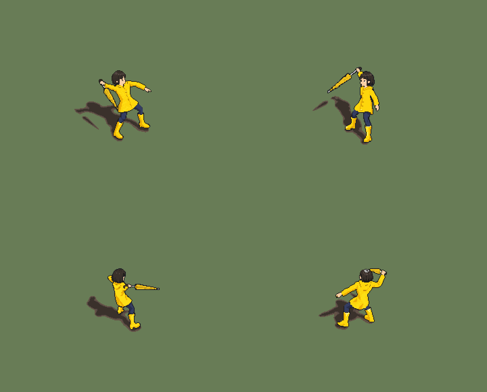

**솔직히:** 그린 게 아니라 계산한 것이라 손그림 같은 맛보다는 깔끔한 쪽이에요. 길은 손에 든 물건의 것이라
동작에 쥔 물건이 있어야 해요. 우산 베기에서만 만들어 봤어요.

### 두 동작 잇기: 휘두르기로 들어가고 다시 나오기

걷기는 공격의 첫 자세로 끝나지 않고, 공격도 걷기 자세로 끝나지 않아요. 그대로 이으면 몸이 튀어요. 3D 리그가 그 사이 프레임을
만들어요(요청 반영). `{"name": "ready", "between": ["walk", "slash"], "frames": 3}`, `{"name": "recover", "between": ["slash:end", "walk"],
"frames": 4}`처럼 적어요. 아래는 전부 그린 그림이에요. 우산을 들고 걷다가, 자세를 낮추고(리그에서 나온 3프레임), 물 이펙트와 함께
휘두르고, 다시 일어나서(4프레임) 걸어요.

<details><summary>우산을 들고 걷다가 자세를 낮추고, 물과 김을 튀기며 휘두르고, 다시 일어나 걷는 우비소녀</summary>


</details>

- **어떻게.** 리그가 두 동작을 동시에 재생하면서 한쪽에서 다른 쪽으로 부드럽게 넘어가요. `"slash:end"`는 공격의 첫 자세 대신 마지막
  자세에서 시작해요.
- **렌더는 무료, 그리기는 다른 동작과 같아요.** 3~4프레임에 시트 한 장, 약 $0.08이에요.
- **이어서 보기**: `charpipe.py loop hero.json --only walk,ready,slash,recover --facing south-east`(무료)가 마무리된 프레임으로 위와 같은
  GIF를 만들어요. 튀는 프레임을 다시 그리기 전에 찾을 수 있어요. 픽셀 세트는
  에디터에서 모든 프레임을 이어 붙인 채로 바로 고칠 수 있어요: `pixeledit.py hero.json --join walk,ready,slash,recover --facing south-east`.
- **한 프레임만 틀렸으면 그것만 다시.** `charpipe.py frame hero.json --only slash --facing south-east --frame 5 --yes`(약 $0.08)가 그
  프레임 하나만 다시 그려요. 동작에 `"frame_words"`를 적으면 그 프레임의 렌더가 못 보여주는 것을 이미지 모델에 알려줘요. 위의 5번은
  왼손 주먹이 우산 위에 떠 있게 다섯 번 그려졌는데, 손이 머리 뒤에 대부분 가려져 있다고 알려주니 제대로 나왔어요.
- **손에 든 물건은 계속 손에 있어요.** 걷기에서도 들고 있으려면 걷기가 그 물건을 들어야 해요(여기서는 걷기 클립에 우산을 쥔
  동작을 하나 만들었어요). 그러지 않으면 첫 중간 프레임에서 물건이 갑자기 나타나요.

### 픽셀아트 (아케이드 크기)

<details><summary>비 오는 소녀가 다섯 방향으로 눈덩이를 던지고, 눈덩이가 아이소메트릭 바닥 위로 각자 방향으로 날아가는 모습</summary>


</details>

픽셀로 그린 게임(벨트스크롤, 격투, 아케이드 플랫포머)에는 같은 캐릭터를 진짜 픽셀아트로 만들어요. 키 약 100px, 픽셀 하나에 색
하나, 40색쯤의 팔레트, 어두운 외곽선, 번짐 없음, 프레임마다 3D 그림자. 일러스트 프레임을 줄인 게 아니에요. 순서가 반대예요.

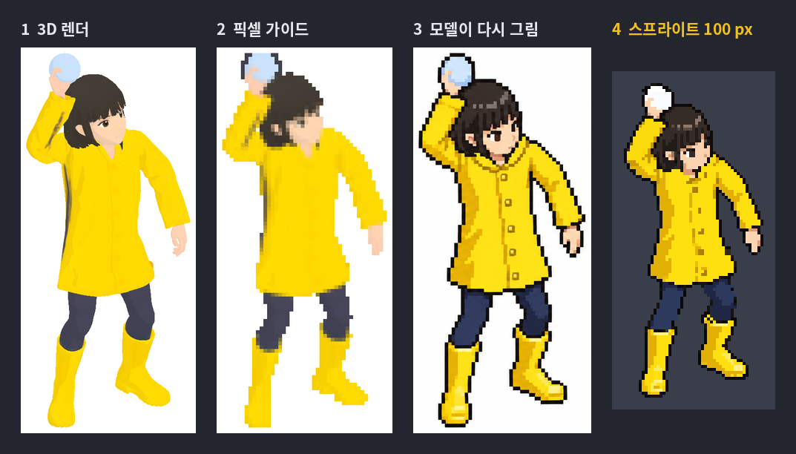

3D 렌더를 픽셀화해서 가이드로 주면 이미지 모델이 픽셀아트로 다시 그려요. 그 그림을 **모델이 그린 격자 그대로 다시 읽어요.**
머리는 머리만의 격자선으로 읽어서 눈과 입이 살아남아요. 크기와 위치는 렌더에 맞춰요.

```
$PYTHON skills/spritecast/scripts/pixelart.py hero.json                        # 계획과 비용만 보여 줘요. 돈은 안 써요
$PYTHON skills/spritecast/scripts/pixelart.py hero.json --clips walk,throw --yes
```
시트 한 장에 약 $0.075예요. 8방향 걷기는 18장(약 $1.35), 위의 던지기 5방향은 14장이었어요.

- **쥐고 던지는 물건.** `"hold": {"kind": "snowball", "until": "auto"}`라고 쓰면 손에 쥐여 주고, 손이 가장 빠를 때 놓아요.
  `pixel.json`에 몇 번째 프레임에, 프레임 안 어디에서, 어느 방향으로, 얼마나 빠르게 나가는지 적혀서 엔진이 발사체를 만들 수
  있어요. 공, 날아가는 모양, 4프레임 터지는 효과도 같이 나와요. 위 그림은 그 데이터를 그대로 재생한 거예요.
- **Mixamo 애니메이션 아무거나.** `addclip.py hero.json Throw.fbx throw`가 FBX 클립을 캐릭터 리그에 옮겨요. 무료예요. 위의
  던지기도 그렇게 넣었어요.
- **이어지는 콤보.** `motion.py`가 게임처럼 공격과 공격을 이어요. 다음 공격이 앞 공격이 끝난 자세에서 시작하고, 휘두르는 순간은 그대로예요.
  옮겨 온 동작의 뜬 발을 땅에 붙이고, 도끼질을 원호를 그리는 칼 베기로 바꿔요. 리그에서 하니 무료예요 - [Mixamo부터 게임까지 레시피](skills/spritecast/reference/character.md).
- **스스로 검토해요.** 프레임마다 렌더와 비교해요(자세, 쥔 물건). `--redraw`는 표시된 시트를 다시 그리고 더 나은 쪽을 남겨요.
  던지기 40프레임은 한 번 다시 그린 뒤 전부 통과했어요.
- **마지막은 픽셀 에디터로.** 픽셀아트는 규칙만으로 다 되지 않아요. `pixeledit.py hero.json`을 실행하면 모든 프레임이 브라우저에
  떠요. 남은 흰색을 클릭 한 번으로 지우고(매직 지우개), 연필로 찍고, 색을 바꾸고, 선택한 부분을 옮기고, 잘 나온 얼굴을 다른
  프레임에 복사해요. 팔레트에 원하는 색을 추가할 수 있고, 프레임 자체도 복사(중간 동작을 그려 넣기 - 8프레임을 9프레임으로)·삭제·이동할 수
  있어요. 그림자와 게임용 데이터도 따라 바뀌어요. 고친 건 저장돼서 다음에 다시 만들어도 그대로 얹혀요.
  이어서 재생되는 동작들은 하나로 열어, 루프 전체를 재생하며 튀는 곳을 고칠 수 있어요:
  `pixeledit.py hero.json --join walk,ready,slash,recover --facing south-east`.

<details><summary>픽셀 에디터</summary>


</details>

그 프레임을 그릴 때 본 3D 렌더를 옆에(단축키 `3`) 또는 아래에 흐리게 띄울 수 있어요. 애매한 픽셀이 원래 뭐였는지 보고 고쳐요.

<details><summary>픽셀 에디터</summary>


</details>

손이 얼마나 가는지: 거의 안 가요. 던지기 40프레임은 AI 그리기 약 6분, AI 누끼 2분이 걸렸어요. 손으로 한 건 매직 지우개뿐이에요.
남은 흰색을 클릭 한 번씩, 40프레임 중 10프레임에서 지웠어요(131픽셀, 스프라이트의 0.15%). 얼굴은 손대지 않았어요. 파이프라인이 만든 그대로예요. 이 숫자는 만들
때마다 출력돼요.

**더 어려운 세트, 그리고 손이 한 일.** 무기나 우산처럼 들고 있는 물건이 있으면, 그 디테일을 조금 손봐야 해요. 프레임마다
몇 픽셀씩이고, 지우개와 연필만 쓰면 돼서 그림을 못 그려도 할 수 있는 수준이에요. "두 동작 잇기"의 루프를 픽셀아트로 만든 거예요.
우산을 들고 걷다가, 자세를 낮추고, 휘두르고, 다시 일어나 걸어요. 네 동작을 이은 23프레임이에요. 손으로 고친 건 들고 있는 우산뿐이에요.
우산의 끝과 가장자리를 프레임마다 같게 맞췄어요. 캐릭터는 고치지 않았고, 남은 흰 점 몇 개를 지우개로 지운 정도예요. 모두 합쳐
1,196픽셀(51,442픽셀 중 2.3%)이고, 그림을 그리지 않는 사람이 에디터에서 몇 분 만에 했어요. 빨리 끝난 이유이자 픽셀아트에서 가장 중요한 것: 프레임을 하나씩이 아니라 23프레임을 이어서 재생하며 보는 거예요. 고치는 건
프레임이 넘어갈 때 픽셀이 크게 바뀌는 부분이 없게 하는 일이에요. 고치지 않은 것: 걷기 두 프레임에서 우산이 3D의
각도와 길이에서 조금 벗어나 있어요.


- **에디터가 3D의 위치를 보여줘요** (단축키 `4`). 손에 든 물건은 빨강, 몸의 윤곽은 파랑으로 그리는 프레임 위에 겹쳐요. 우산을 너무
  길게 그렸거나 각도가 틀리면 바로 보여요.

<details><summary>픽셀 에디터</summary>


</details>

**색 수.** 한 세트는 약 40색으로 나와요. `--colours 16`은 최대 16색으로 줄이고(최소 8), `--palette`는 정해진
팔레트에서 가장 가까운 색을 픽셀마다 골라요. 스킬에 들어 있는 15개는 이름으로 쓰고(`--palette pico8`, 목록은 `--palette list`),
내 파일은 Aseprite가 읽는 형식이면 돼요: `.png` `.gif` `.bmp` `.pcx`, `.hex`(Lospec), `.gpl`, `.pal`, `.act`, `.col`, `.aseprite`.
둘 다 무료예요. 다시 그리지 않고 같은 그림을 다른 팔레트로 읽기만 해요. 프롭에도 같은 옵션이 있어요. 16색까지는 캐릭터가 잘
유지되고, 8색에서는 비슷한 색이 합쳐져요(남색 다리가 검정이 돼요). 팔레트에 캐릭터 색과 가까운 색이 없으면 그 색은 바뀌니까,
결과를 보고 정하세요.

<details><summary>같은 스프라이트 세 개</summary>

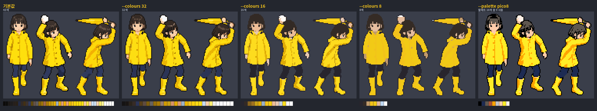

</details>

들어 있는 팔레트를 같은 스프라이트 두 개에 입힌 모습이에요. 노란 우비는 팔레트에 노랑이 있어야 해요(`c64`, `gameboy`, `slso8`,
`sweetie16`에는 없어요).

<details><summary>우비소녀와 라멘 수레를 15개 팔레트로</summary>


</details>

*팔레트는 만든 분들의 것이에요: AAP-64(Adigun A. Polack), Apollo(AdamCYounis), DawnBringer 16/32(DawnBringer), Endesga 32/64(ENDESGA),
Resurrect 64(Kerrie Lake), SLSO8(Luis Miguel Maldonado), Sweetie 16(GrafxKid). [Lospec](https://lospec.com/palette-list)에서 가져왔어요.*

**크기.** 보통 비율의 캐릭터는 96px가 맞아요. **64px는 그 크기에 맞춰 디자인한 캐릭터**(3등신쯤, 자기 3D 모델)에서 되고, 실제로는
약 70px로 나와요. 그보다 작은 건 이미지 모델에 직접 부탁하지 않아요. 칸이 그렇게 적으면 격자를 못 지키거든요(32px는 네 가지
방법으로 해 봤어요). `--px 32`라고 하면 64로 그린 뒤 그 세트를 줄여서 32px 세트를 만들어요. 무료이고 동작과 프레임은 같지만 얼굴은
더 거칠어요. 잘 나오는 건 64예요.

<details><summary>작은 캐릭터가 8방향으로 걷고 던지는 64px 세트와, 그걸 줄여 만든 32px 세트</summary>


</details>

두 세트 모두 [`examples/rain_chibi`](examples/rain_chibi)에 있어요: 비옷 소녀에서 그린 3등신 디자인, 턴어라운드, 사양 파일,
`pixel64/`(8방향 걷기와 던지기, 128프레임, 프레임마다 그림자. 손으로 고친 픽셀은 없어요), 그리고 거기서 만든
`pixel32/`. 던지기는 Mixamo 클립을 `addclip.py --clear-head 55`로 얹은 거예요. 클립과 리그는 저장소에 넣지 않았어요.

<details><summary>같은 작은 캐릭터의 다섯 가지</summary>

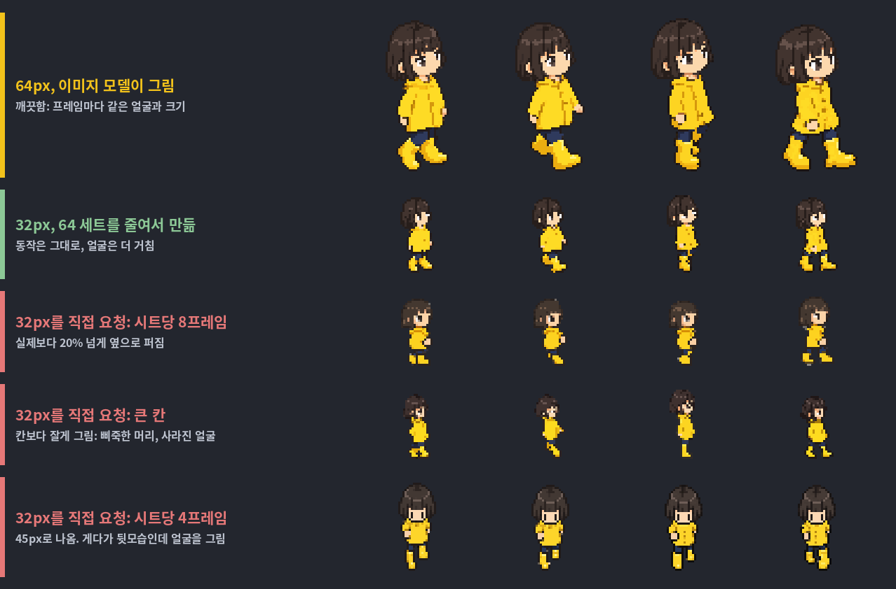

</details>

**왜 32px를 직접 요청하지 않나요?** 이미지 모델(GPT)은 64 아래의 작은 픽셀아트를 잘 못 그려요. "픽셀" 크기를 제멋대로 잡아서(8px 칸을
부탁하면 7.4~10.8px로 그렸어요), 칸이 32개뿐이면 한 칸만 어긋나도 눈 하나가 사라져요. 위 그림에서 맨 윗줄이 64로 그린 것이고, 빨간
세 줄은 32px를 직접 요청한 것(시트 배치만 다른 같은 걸음)이에요. 그래서 스킬은 64로 요청하고 32는 거기서 줄여 만들어요(초록 줄). 자세한 내용: [reference/pixel.md](skills/spritecast/reference/pixel.md).

위 스프라이트는 [`examples/rain_girl/pixel`](examples/rain_girl/pixel)에 있어요: 던지기 5방향, 걷기 2방향, 우산 베기 스트립과
그림자, 눈덩이와 날아가는 모양·터지는 효과, 발사 데이터가 든 `pixel.json`.

### 픽셀아트 소품: 어떤 물건이든, 어느 방향이든

<details><summary>라멘 포장마차의 3D 모델 네 방향과, 같은 네 방향의 픽셀아트 스프라이트</summary>


</details>

캐릭터와 같은 순서를 물건에 써요. 3D 가이드를 픽셀화하고, 이미지 모델이 같은 격자 위에 픽셀아트로 다시 그리고, 그 그림을 격자대로
다시 읽어서 가이드 크기에 맞춰요. 각도는 카메라가 정하니까, 네 방향으로 돌린 물건은 한 물건의 네 스프라이트가 돼요. 같은 지붕,
같은 바퀴, 방향마다 있어야 할 것이 제자리에 있어요.

```
$PYTHON skills/spritecast/scripts/isoprop.py model cart.json --yes    # Tripo가 설명에서 3D 모델을 만들어요 (약 20크레딧)
$PYTHON skills/spritecast/scripts/isoprop.py render cart.json         # 무료: 방향마다 가이드 ("views": [0, 90, 180, 270])
$PYTHON skills/spritecast/scripts/proppixel.py cart.json --yes        # 방향마다 약 $0.08 → out-pixel/sprite-<방향>.png
```

- **진짜 3D 모델이 있어야 방향이 맞아요.** 블록만으로는 어느 면에 무엇이 있는지 이미지 모델이 알 수 없어요. 블록으로 한 오락기는
  네 방향 중 하나에서 화면이 엉뚱한 면에 그려졌어요. 위 포장마차는 Tripo 모델이고, 네 방향 모두 첫 그림에서 모델과 맞았어요.
  단순한 물건(의자, 상자)의 한 방향은 블록으로도 괜찮아요.
- **캐릭터와 같은 축척.** `--ppm`은 1미터당 픽셀 수예요. 픽셀 캐릭터의 키(픽셀)를 키(미터)로 나눈 값을 주면(예시의 작은 캐릭터는
  54) 소품과 캐릭터가 같은 픽셀 크기로 한 바닥에 서요.
- **누끼는 직접 마무리할 수 있어요.** 지붕 아래와 바퀴살 사이의 빈 곳은 AI 누끼가 비워 줘요. 남은 건 캐릭터와 같은 픽셀 에디터로
  열어서(`pixeledit.py cart.json`) 고쳐요. 네 방향이 네 프레임으로 뜨고, 3D 렌더를 옆이나 아래에 같이 볼 수 있고, 지운 건 저장돼요.
  위 포장마차는 그렇게 122픽셀을 마무리했어요.
- 포장마차는 [`examples/ramen_cart`](examples/ramen_cart)에 있어요: 사양, Tripo 모델, 네 방향
  가이드와 스프라이트.

<a name="light-shadow-wind"></a>
### 3D 모델에서 나오는 빛, 그림자, 바람

소품의 네 면을 만들어 준 모델은 빛이 어디서 막히는지, 가지가 어디 있는지도 알고 있어요. 그래서 그림자, 바닥에 퍼지는 조명 빛,
나뭇잎의 바람을 모델에서 계산해요 - 무료로, 내 컴퓨터에서, 그리기 없이.

- **그림자는 3D 모델에서 구워요** (무료, 몇 초, 저절로): 땅에 닿는 해의 빛과 하늘의 빛을 물체가 가리는 만큼씩 계산해서, 가까이는
  진하고(수레 아래, 줄기 밑동 둘레) 높은 데서 드리운 그림자는 옅게(나뭇잎 그림자, 잎 사이로 빛이 새요) - 픽셀 아트답게 5단계로. 해는 가이드의
  빛 그대로라 소품에 그려진 음영과 땅의 그림자가 맞아요. 흐린 날은 `--shadow overcast` (또는 사양에 `"shadow": "overcast"`): 해 없이
  둘레의 부드러운 그늘만. `out-pixel/shadow-<방향>.png`, 위치는 `pixel.json`에 있어요. 스프라이트 밑에 깔면 돼요.


- **그림자의 진하기** (무료): 사양의 `"shadow_strength"`나 `--shadow-strength`로 정해요. 그림자를 그 횟수만큼 겹쳐 그린 것과 같아요.
  빛이 주는 그대로(1)의 그림자는 맞지만 약해요. 어두운 땅에서는 묻혀서, 스프라이트가 땅에 서 있지 않고 떠 있는 것처럼 보여요.
  픽셀 아트는 실제보다 조금 더 과장해야 해서, **픽셀 스프라이트는 소품이든 캐릭터든 기본이 1.5**예요(가장 진한 곳이 56% 대신 71%).
  밝은 바닥에서 무거워 보이면 1을, 아주 어두운 땅이면 2를 쓰세요. 빛 편집기에 슬라이더가 있어요.

<details><summary>같은 나무와 우비 소녀를 그림자 세기 1, 1.5, 2로 놓은 모습</summary>


</details>

- **실내에서는 조명을 원하는 곳에.** `--lamp -1,2.4,-0.2 --lamp-size 0.03` (소품 발밑에서 미터 단위로 오른쪽, 위, 보는 사람 쪽;
  조명 자체의 크기) - 그림자는 조명 반대쪽으로, 조명이 낮을수록 길게, 맨전구는 또렷하게 큰 갓은 부드럽게, 바닥에 퍼지는 빛만큼
  옅어지며 떨어져요. 바닥에 퍼지는 빛도 같이 나와요 - `light-<방향>.png`: 조명 바로 아래가 가장 밝고, 소품이 가린 자리는 빠지고, 단계는
  디더링으로 이어져요. 바닥 위에 더하기(ADD)로 깔면 돼요. 광원도 픽셀 아트(`lamp.png`)로 나오고,
  면마다 그 위치가 `pixel.json`에 적혀서 게임이 바닥, 빛, 그림자, 소품, 광원을 편집기에서 본 그대로 그릴 수 있어요. 안 적으면 해가 기본이에요. **비치는 부분**(라탄 짜임, 나뭇잎, 그물)은 모델에 칠해져 있을 뿐 뚫려 있지 않아서,
  `"see_through": [{"colour": "#c8955a", "open": 0.35}]`로 그 색 부분이 빛을 그만큼 통과시키게 해요. 라탄 공작 의자
  ([`examples/rattan_peacock_chair`](examples/rattan_peacock_chair))를 조명 여섯 가지 아래에서:

<details><summary>라탄 공작 의자 픽셀 아트를 해, 흐린 날, 맨전구, 앞과 뒤의 조명, 높은 큰 조명 아래 오크 마루에 둔 모습</summary>


</details>

- **광원을 직접 옮겨 보기**: `lightedit.py PROP.json`을 실행하면 내 컴퓨터에서 페이지가 열려요. 바닥을 끌어 광원을 옮기고, 휠로
  높이를, 슬라이더로 크기를 바꾸면 그림자와 바닥에 퍼지는 빛이 바로 다시 그려져요. 저장하면 네 면을 그 빛으로 굽고 사양에 남겨요.
  **내 램프로**: 램프 그림(소품과 같은 크기로 오려 낸 PNG)을 불러와서 빛이 나오는 곳을 클릭하면, 끄는 곳에 서고(소품 앞이면 앞에, 뒤면
  뒤에) 빛은 거기서 나와요. 그림자, 빛무리, 바닥 빛은 픽셀 아트(단계, 디더링)나 매끈하게(그러데이션, 픽셀 아트가 아닌 게임용: `"light_style": "smooth"`) 고를 수 있어요. 아래는 픽셀 플로어 램프
  (`examples/lamps/floor_lamp/out-pixel/sprite.png`)를 앞에, 뒤에, 매끈하게 둔 모습이에요.

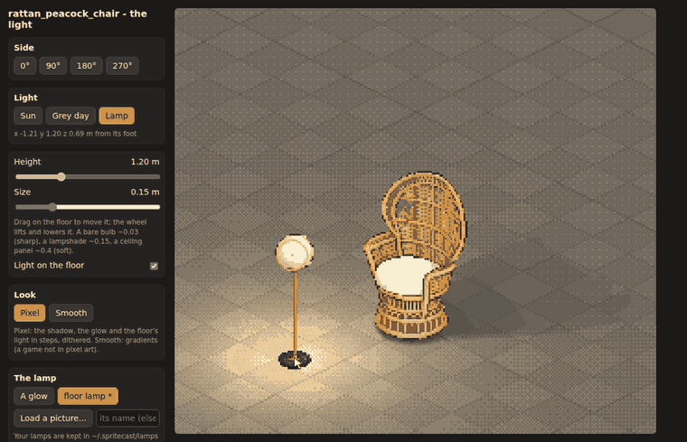

<details><summary>광원 편집기에서 픽셀 플로어 램프를 라탄 의자 둘레로 옮긴 모습</summary>


</details>

- **바람에 흔들리기도 3D 모델에서** (사양에 `"sway": "leaves"`, 또는 `propshade.py PROP.json --sway leaves`; 무료): 수관은 한 장이 아니라
  가지들이에요. 잎 픽셀마다 그 자리에 보이는 모델의 점을 찾고, 그 점들을 3D 위치로 묶어서(앞 가지와 뒤 가지가 따로) 뭉치를 만들어요.
  뭉치는 모양 그대로 1px씩 움직이고, 뒤쪽부터 그려요. 줄기는 가만히 있어요. 그림을 일그러뜨리지도, 프레임을 손으로 그리지도 않아요.
  `sway-<방향>.png`(12프레임 × 잔잔함/산들바람/돌풍 - 한 줄을 반복 재생), 직접 움직일 수 있게 뭉치 지도 `clumps-<방향>.png`와 각 뭉치의
  3D 위치, `preview-sway.gif`가 나와요. 나무는 [`examples/forest_tree`](examples/forest_tree)에 있고, 잎 사이로 그림자에 빛도 새요.


- **어디가 막히는지도 같은 모델에서** (무료, 그림자와 함께 구워져요): `solid-<side>.png`는 걸어 들어갈 수 없는 곳이에요. 모델을 땅
  가까이에서 잘라 만든 소품의 발자국이에요(나무 밑동, 다리 넷으로 선 탁자). `"collide": {"cover": [0.55]}`를 넣으면 그 높이로 날아가는
  것이 막히는 곳도 나와요. 줄기는 불덩이를 막고, 그 위 나뭇잎은 안 막아요. 둘 다 위치와 충돌 폴리곤용 외곽선이 같이 나와요. 그리고
  **캐릭터가 그늘에서 어두워져요**: 그림자마다 땅 위 높이에 따라 읽는 법이 적혀 있어서, 발, 허리, 머리가 각자 해와의 사이에 있는 것만큼 어두워져요.
- **엔진으로**: `export.py PROP/out-pixel`이 Phaser 3 모듈과 Godot 4 씬을 써 줘요. 그림자, 조명 빛, 바람, 발자국 충돌 폴리곤, 그리고
  물어볼 수 있는 `shade()` / `cover()`가 들어 있어요(Phaser 3.90과 Godot 4.7에서 열어 확인했어요. Unity와 Aseprite는 아직 캐릭터만
  돼요). 작은 것도 흔들려요: 버섯은 갓이 까딱거려요(`"sway": "caps"`, [`examples/forest_mushrooms`](examples/forest_mushrooms)).

<details><summary>Phaser로 내보낸 픽셀 아트 나무 둘과 버섯 세 무더기가 풀밭에 있는 장면</summary>

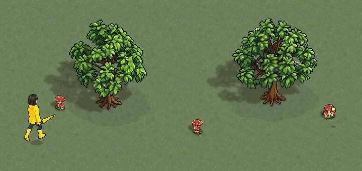

</details>

### 그리기 건너뛰기: 3D 렌더를 그대로 프레임으로

사양에 `"draw": false`를 쓰면 프레임을 이미지 모델이 그리지 않아요. 3D 모델 자체의 렌더(툰 셰이딩, 모델 자체 텍스처)가 그대로
프레임이 되고, 3D 그림자와 앵커는 똑같이 나와요. 이미지 모델은 턴어라운드(약 $0.09)만 그려요. 리깅된 GLB를 직접 주면(`"rig_glb"`,
동물은 모델 `"model_glb"`) 이미지 모델을 아예 안 써요. 그러면 캐릭터 하나에 턴어라운드와 3D(Tripo 75크레딧, 동물 30)만 들고,
확인은 두 번, `3d`가 끝나면 바로 완성이에요. 대신 선명도가 떨어져요: 그린 선이 없고, 얼굴이 단순하고, 모델 텍스처가 그대로라 털과 주름이 흐려요.

<details><summary>같은 여자아이와 고양이</summary>

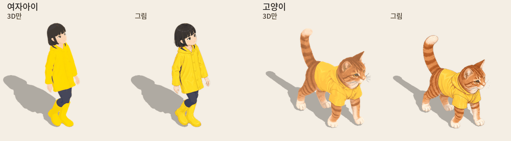

</details>

<details><summary>스트립 실제 픽셀로 확대</summary>

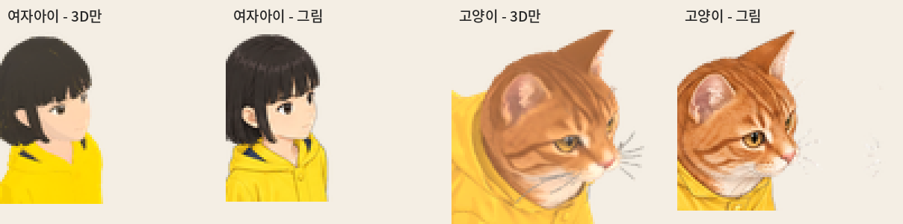

</details>

## 앉기


걷는 캐릭터가 있으면 Claude에게 *"앉혀 줘"*라고 해 보세요. 3D 모델을 앉은 자세(허벅지 수평, 무릎 굽힘, 손은 허벅지 위)로 8방향
렌더하는 건 무료예요. 렌더를 확인한 뒤 서 있는 모습처럼 그려요(시트 2장, 약 $0.22). 의자 없이 앉아 있어서 게임의 의자를 밑에
두면 돼요. `character.json`에 `sit`이 생겨요. 방향마다 파일, **앉는 점**(의자 좌석에 맞출 점, `anchor`처럼 프레임의 비율), 좌석
높이, 그림자가 들어 있어요. 소품에 앉히려면 `seat.py`가 좌석 위에 앉히고, 캐릭터를 가리는 **앞 조각**(팔걸이, 장의자 등받이, 벤치
등받이)을 둘의 3D 높이로 계산해요. 칠할 필요가 없어요.

<details><summary>비 오는 소녀가 열 가지 좌석에 앉은 모습</summary>


</details>

좌석 높이와 방향을 찾고, 무릎이 좌석 앞 모서리에 오도록 엉덩이 위치를 정해요. 조금 어긋나 보이면 다듬기 페이지(아래)에서 끌어서
옮기면 돼요. 놓는 순간 그 자리에서 앞 조각을 다시 계산해요.
자세한 내용은 [reference/sitting.md](skills/spritecast/reference/sitting.md)에 있어요.

```
$PYTHON skills/spritecast/scripts/charpipe.py sit <name>.json            # 무료: 앉은 렌더
$PYTHON skills/spritecast/scripts/charpipe.py sit <name>.json --draw     # 약 $0.22: 그리고 마무리
$PYTHON skills/spritecast/scripts/seat.py <prop>.json <name>.json --height 1.3   # 무료: 소품에 앉히고 앞 조각 계산
```

## 손으로 다듬기


자동 단계로 대부분은 되지만, 마지막은 눈으로 보고 손으로 하는 게 가장 정확해요. **손으로 칠하는 게 어떤 자동 단계보다
정확해요.** 위 그림에서 장의자는 자동 계산으로는 등받이가 소녀를 거의 다 가렸는데, 손으로 칠하고 소녀를 위로 옮기니 제대로
앉아 보여요. 식탁 의자와 안락의자 등받이도 엉뚱한 곳을 잘랐던 걸 손으로 고쳤어요. 누끼도 늘 완벽하지는 않아요. 팔과 몸 사이에 종이가 조금 남거나, 흰 셔츠를 종이로 알고 지우기도 해요. Claude에게 다듬기 페이지를
열어 달라고 하거나 `$PYTHON skills/spritecast/scripts/touchup.py <spec>.json`을 실행하면, 그 소품이나 캐릭터의 완성된 그림이
전부 브라우저에 떠요. 칠하는 대로 저장돼요.

| 색 | 하는 일 |
|---|---|
| 빨강 | 지우기: 투명하게 |
| 초록 | 되살리기: 그 픽셀을 원래 그림에서 가져와요("drawing under"를 켜면 원래 그림이 밑에 보여요) |
| 파랑 (소품) | **앞 조각**: 그 안에 선 캐릭터보다 앞에 오는 부분. 아치의 앞 기둥, 정자 지붕, 의자의 앞쪽 팔걸이 |
| ⬠ 다각형 (P) | 꼭짓점을 클릭하고 닫으면(더블클릭, Enter, 첫 점 클릭) 지금 칠하는 색으로 채워지거나 지워져요 |
| 🪑 (좌석) | 앉은 캐릭터를 끌어서(또는 방향키로) 옮겨요. 놓으면 그 자리에서 좌석과 앞 조각을 다시 만들어요 |

다 칠하면 `touchup.py <spec>.json --apply` (캐릭터는 스트립을 다시 묶어요). 앞 조각을 칠한 소품은 `sprite-front.png`와
`sprite.json`의 `"front"`가 생겨요. 소품을 캐릭터 뒤에 그리고 앞 조각을 그 위에 그리면 돼요. `finish`를 다시 돌려도 칠한 내용은
다시 입혀지고, 칠한 뒤에 다시 그려진 그림에는 입히지 않고 따로 빼 둬요.

**픽셀 스프라이트**는 픽셀 단위로 고치는 에디터가 따로 있어요. [픽셀아트](#픽셀아트-아케이드-크기) 참고.

## 소품과 배경


이미지 모델에 "아이소메트릭 안락의자"를 그려 달라고 하면 예쁘긴 한데 각도가 조금씩 틀려요. 다시 그리면 또 다른 각도, 다른 크기로 나와요.
열 개를 한 바닥에 놓으면 하나도 맞지 않아요.

SpriteCast는 모델이 잘못 읽기 어려운 가이드를 줘요(잘못 읽으면 알려 줘요).
1. Claude가 물건을 **실제 크기(미터)**의 블록으로 짜요.
2. 블록을 게임의 **정확한 카메라**로 렌더해요.
3. 이미지 모델은 그 가이드를 **원하는 그림체**로 다시 그리기만 해요.
4. 그린 그림을 오려서 **가이드의 상자에 맞춰 놓아요.** 그래서 크기와 바닥 차지 면적은 가이드와 같아요. 윤곽이 가이드를 따르지 않는
   그림은 억지로 맞추지 않고 경고해요. 그림자와 엔진용 앵커도 같이 나와요.

소품은 일러스트로 나와요(`cozy`: 부드러운 명암, 가는 외곽선). 내 그림 한 장을 주면 그 그림체로 나와요.

## 사용 흐름


소품을 설명하면 Claude는 빠진 것만 물어봐요(크기, 방향, 게임 시점, 그림체). 그다음 가이드를 무료로 렌더해서 보여 주고, 비용을 말한 뒤
승인을 기다려요. 결과로 `sprite.png`, `shadow.png`, `sprite.json`을 받아요.

## 예시

모두 [`examples/`](examples)에 있고, 사양 파일과 만들어진 파일이 들어 있어요(원본 그림은 저장소를 가볍게 하려고 WebP로).

| | | |
|---|---|---|
| 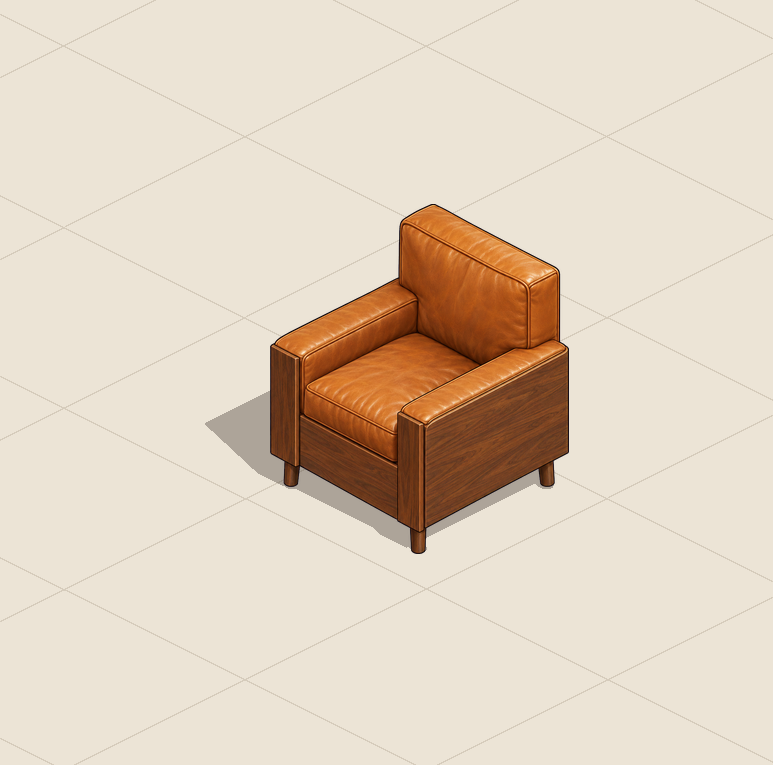 |  |  |
| `reading_armchair`: 블록 9개(좌석, 등받이, 팔걸이, 다리) | `potted_monstera`: 화분, 그리고 식물은 덩어리 하나로 | `arcade_cabinet`: 정면이 왼쪽 아래를 향함 |

<details><summary>네 방향과 탑다운</summary>


</details>
`armchair_four_ways`: `views: [0, 90, 180, 270]`. 두 번째 방향부터는 첫 그림을 레퍼런스로 그려서 같은 의자로 이어져요.
`arcade_cabinet_topdown`: `camera: "topdown"`. `reading_armchair_tripo`: 같은 안락의자를 Tripo 모델로(아래).

예제의 3D 모델(`reading_armchair_tripo`, 걷는 캐릭터들의 모델과 리그)은 [Tripo](https://www.tripo3d.ai) API로 만들었어요.

## 더 정교하게: 3D 모델을 먼저 (Tripo)

<details><summary>블록 가이드와 Tripo 모델 가이드 비교</summary>


</details>

배치와 크기가 중요하면 블록으로 충분해요. 디테일(곡선 팔걸이, 가늘어지는 다리, 단추, 조각)을 더 살리고 싶으면
[Tripo](https://www.tripo3d.ai)로 설명에서 진짜 3D 모델을 먼저 만들어요. 그 모델을 블록이 정한 높이로 키우되 모델 자신의 비율은 그대로 두고 가이드로
써요(그때 차지하는 바닥 면적은 `sprite.json`에 적혀요. `"shape": "box"`를 쓰면 블록 상자에 눌러 맞춰요). 이미지 모델은 실제 형태 위에 그리고, 3D 그림자도 모델 자신의 것이 돼요.

```
$PYTHON skills/spritecast/scripts/isoprop.py model  armchair.json --yes   # Tripo로 3D 모델 만들기 (Tripo 크레딧 약 20-40, 약 2분). 사양이 이 모델을 쓰게 바뀌어요
$PYTHON skills/spritecast/scripts/isoprop.py yaws   armchair.json         # 무료: 모델을 네 방향으로 돌려 보여 줘요. 맞는 방향을 "model": {"yaw": ...}에 적어요
$PYTHON skills/spritecast/scripts/isoprop.py render armchair.json         # 그다음은 평소처럼 draw, finish
```
`TRIPO_API_KEY`가 필요해요. 블록은 사양에 `blocks_draft`로 남아요.

## 포즈 잡은 인물 (설명만으로)

<details><summary>마네킹 가이드와 네 방향 인물 두 명</summary>


</details>

서 있는 인물도 같은 방식이에요. Claude가 실제 키의 마네킹을 세워서 방향마다(4 또는 8방향) 렌더하면, 이미지 모델이 설명대로 옷을 입혀
그려요. 첫 방향을 먼저 그리고 나머지는 그 그림을 따라 그려서 같은 사람으로 이어져요.

```json
{ "name": "barista",
  "character": { "height": 1.63, "build": "slim", "directions": ["south-east", "south-west", "north-east", "north-west"] },
  "description": "a cheerful young café barista: a short dark-brown bob, a cream cable-knit sweater under a forest-green apron, ..." }
```

앵커는 두 발 사이예요. 첫 방향은 약 $0.07, 나머지는 방향마다 약 $0.08예요.

<details>
<summary><b>자세, 각도 직접 주기, 한 방향만 다시 그리기</b></summary>

**자세.** 마네킹에 관절이 있어서 자세를 고를 수 있어요. `"pose"`는 다음 중 하나예요.
- `stand` (기본, 차렷)
- `wave` (손 흔들기)
- `point` (가리키기)
- `hold` (두 손을 앞에 모음: 컵, 쟁반, 책)
- `arms-crossed` (팔짱)
- `walk` (걷는 중)

설명에도 맞춰 적어 주세요("손 흔들며 인사", "커피잔을 두 손으로 들고"). 각도를 직접 적을 수도 있어요. 그러면 Claude가
"팔을 더 높이" 같은 요청을 숫자로 바꾸고, 무료 렌더로 확인하면서 고쳐 줘요.

```json
"pose": { "base": "stand", "arm": { "left": [[150, 10], [170, 10]], "right": [[150, 10], [170, 10]] } }
```
팔다리마다 위·아래 두 마디가 있고, 각 마디는 `[옆으로, 앞으로]` 각도예요. 먼저 옆으로 벌리고 그다음 앞으로 들어요. `left`, `right`는
캐릭터 자신의 왼쪽과 오른쪽이에요.


**방향마다 한 장짜리 그림이에요.** 걷는 캐릭터는 [걷는 캐릭터](#걷는-캐릭터)를 보세요.
방향마다 직접 확인하세요(머리가 엉뚱한 쪽을 보는 건 윤곽 검사로 못 잡아요). 한 방향만 다시 그리려면
`draw <spec> --yes --again --only north-west`.

</details>

## 그림에 맞는 그림자

3D 가이드에서 계산한 그림자는 가구처럼 단단한 물건에는 잘 맞아요. 그런데 완성 그림에는 블록에 없던 것들이 있어요. 머리카락, 코트 모자,
화분 밖으로 뻗은 잎 같은 거예요.

<details>
<summary><b>그림자를 계산하는 방법</b></summary>

그래서 가이드의 **높이 지도**를 같이 렌더해요. 픽셀마다 바닥에서 몇 m 위에 있는지 기록한 거예요. 높이가 h인 점의 그림자는 깊이와
상관없이 화면에서 "h × 빛의 이동량"만큼 떨어진 곳에 떨어져요. 그래서 그림의 각 픽셀이 그 아래 가이드의 높이를 가져와서 그만큼
옮겨져요. 가이드 밖으로 나간 머리카락이나 잎은 가장 가까운 가이드 지점의 높이를 써요.

모양은 그림 그대로이고, 시작점은 3D 모델이 정해요. 양쪽 발이 각자 자기 그림자를 시작하고, 화분 그림자는 화분 바닥에서 시작해요.
정확해야 하는 건 바닥에 닿는 부분뿐이라, 위로 갈수록(물체 높이의 10%에서 35%까지) 화면에서 읽은 부드러운 높이로 서서히 넘어가요. 그래서
머리카락, 모자, 잎의 그림자가 마네킹의 각진 모양이 아니라 자연스럽게 나와요. 바닥에 닿는 부분(블록의
아래 12cm, 즉 신발이나 화분 바닥)에는 가이드의 3D 그림자를 더해요. 그래서 그림자가 실제처럼 빛 반대쪽에서만 물체에 붙고, 앞쪽으로는 생기지
않아요. 포즈 잡은 인물과 `loose` 물건은 이 방식을 쓰고, 단단한 소품은 3D 그림자를, 걷는 캐릭터는 3D 몸의 그림자를(위)
써요. `"shadow": "drawn" | "guide"`로 직접 고를 수도 있어요.

</details>

<details><summary>블록 그림자와 그림 그림자 비교</summary>


</details>

**걷는 캐릭터의 그림자는 빛이 떨어지는 대로예요** (0.20부터): 자세를 잡은 3D 몸을 해의 원반 16방향과 하늘 48방향으로 땅에 눌러 찍고, 방향마다 가린
만큼을 더해요. [소품의 구운 그림자](#light-shadow-wind)와 같은 계산이에요. 그래서 발이 닿은 곳과 몸 아래는 진하고 먼 가장자리는 옅으며,
프레임마다 자세에 따라 달라져요. 그림자 띠는 character.json의 `shadow_alpha`(0.56)로 표시하고, 픽셀 세트는 다섯 단계로 나와요.
사양에 `"shadow": "flat"`을 넣으면 이전의 한 가지 농도 그림자가 나와요.

<details><summary>우비소녀가 걷고, 달리고, 뛰는 모습과 그림자</summary>


</details>

## 카메라

| `camera` | 내려다보는 각도 | 어떤 게임에 |
|---|---|---|
| `"iso-2:1"` (기본) | 30°, 45° 회전 | 대부분의 아이소메트릭 게임. 바닥 타일이 가로 2 : 세로 1 |
| `"isometric"` | 35.26°, 45° 회전 | 정아이소메트릭(세 축이 120°) |
| `"topdown"` | 50°, 정면 | 3/4 탑다운 RPG |
| `"front"` | 12°, 정면 | 횡스크롤 |
| `{"pitch": 40, "yaw": 30}` | 아무 각도 | 직접 지정 |

`"light": "left"`로 바꾸면 빛과 그림자가 반대쪽으로 가요.

걷는 캐릭터는 `camera` 대신 `"pitch"`만 받아요: 30(기본, 2:1), 35.26(정아이소메트릭), 50(3/4 탑다운), 12(정면). 8방향은 45°
간격이에요. `camera`는 소품과 포즈 잡은 인물에 써요.

## 엔진에 넣는 법

**Godot, Unity, Phaser, Aseprite용 파일을 바로 만들어요.** `export.py <이름>/out`(무료)이 `out/export/`에 써요.

| | 내용 | 쓰는 법 |
|---|---|---|
| `godot/` | Shadow, Body, Effect가 든 씬과 작은 스크립트 | 폴더를 Godot 4 프로젝트에 넣고 `play("walk", "south-east")` |
| `unity/` | 스트립과 에디터 스크립트 | `Assets/`에 복사하면 프리팹과 애니메이션 클립이 저절로 만들어져요. `GetComponent<Animator>().Play("walk_south_east")` |
| `phaser/` | Phaser 3용 ES 모듈 | `preload(this, base)`, `create(this)`, `add(this, x, y).play('walk', 'south-east')` |
| `aseprite/` | 동작마다 `.aseprite` 한 개 | 방향별 태그, `shadow`·`body`·`effect` 레이어, 발 위치를 표시한 슬라이스 |

캐릭터는 놓은 자리(두 발 사이)에 서고, 그림자는 몸과 같은 프레임으로 움직이고, 휘두를 때의 이펙트가 그 위에 재생돼요. 네 가지
모두 실제로 열어 확인했어요(Godot 4.7, Unity 6000.3, Phaser 3.90, Aseprite). 픽셀 세트는 아직 내보내지 않아요.

직접 넣으려면 필요한 숫자는 모두 JSON에 있어요.

`sprite.json`에 소품이 땅에 닿는 지점이 적혀 있어요.

```json
"sprite": { "file": "sprite.png", "size": [299, 357], "anchor": [0.4993, 0.9966], "anchor_px": [149.3, 355.8] },
"shadow": { "file": "shadow.png", "offset_px": [-66, 116] },
"px_per_m": 256
```

- **anchor**: 바닥 차지 면적의 앞 모서리예요. 정면 시점에서는 앞쪽 변의 가운데예요. 이 점을 소품이 놓일 타일 위에 맞춰요.
- **shadow**: `shadow.png`를 스프라이트 왼쪽 위 모서리에서 `offset_px`만큼 떨어진 곳에 놓아요. 불투명도는 30% 정도로, 모든
  스프라이트 아래에 그려요.
- **scale**: 모두 1m당 `px_per_m` 픽셀로 그려져 있어요. 타일이 1m이고 가로 `T`픽셀인 2:1 맵이면 `T / 1.414 / px_per_m` 배로
  줄이면 돼요.

| 엔진 | 방법 |
|---|---|
| Phaser | `this.add.image(x, y, 'armchair').setOrigin(anchor[0], anchor[1])` |
| Godot 4 | `Sprite2D`: `centered = false`, `offset = -anchor_px` |
| Unity | Sprite Editor → Pivot: Custom, `(anchor[0], 1 - anchor[1])` |

**걷는 캐릭터.** `character.json`에 `frame`(`[w, h]` 픽셀), `anchor`(두 발 사이, 프레임에 대한 비율), `fps`가 있어요.
`walk-<facing>.png`는 8프레임을 가로로 붙인 스트립이고, `idle-<facing>.png`는 한 프레임이에요. 한 방향의 `i`번째 그림자
`shadows.walk[facing][i]`는 `i`번째 프레임의 왼쪽 위 모서리에서 `offset`만큼 떨어진 곳에, 30% 정도 불투명도로 모든 것 아래에
그려요. `px_per_m`은 없어요: 캐릭터가 서 있을 키에 맞춰 프레임 크기를 조절하세요. Phaser에서 `rain_girl`의 수치로:

```js
this.load.spritesheet('girl-se', 'walk-south-east.png', { frameWidth: 165, frameHeight: 256 });
this.anims.create({ key: 'walk-se', frames: this.anims.generateFrameNumbers('girl-se'), frameRate: 6.76, repeat: -1 });
this.add.sprite(x, y, 'girl-se').setOrigin(0.4926, 0.8839).play('walk-se');
```
전체 형식은 [reference/character.md](skills/spritecast/reference/character.md#output-nameout)에 있어요.

## 설치

터미널에서:
```
claude plugin marketplace add Sunghwan0112/spritecast
claude plugin install spritecast@spritecast
```
Claude Code 안에서 할 수도 있어요: `/plugin marketplace add Sunghwan0112/spritecast` 다음 `/plugin install spritecast@spritecast`.

**함께 필요한 건** Python 3.9 이상과 브라우저(Chrome, 또는 Edge - 윈도우에는 늘 있어요)뿐이에요. 처음 쓸 때 Claude가 설치 점검
(`doctor.py --fix`)을 돌려요: `~/.cache/spritecast/`에 전용 가상환경을 만들어 몇 가지 패키지를 넣고(10초쯤), 원래 Python은 건드리지
않고, 각각 무엇에 쓰는지 알려 줘요. 손으로 설치할 건 없어요.

<details>
<summary><b>스크립트를 직접 돌릴 때</b></summary>

**스크립트를 직접 돌릴 때.** 보통은 Claude가 대신 돌려요. 이 저장소를 받아서 손으로 돌리려면 `doctor.py`가 마지막 줄에 찍는
Python(`PYTHON=...`)을 쓰세요. `--fix` 뒤에는 `~/.cache/spritecast/venv/bin/python`이에요(Windows:
`%USERPROFILE%\.cache\spritecast\venv\Scripts\python.exe`). 그냥 `python`에는 패키지가 없을 수 있어요(`No module named ...`). 아래
명령들은 이걸 `$PYTHON`으로 적어요.
```bash
python3 skills/spritecast/scripts/doctor.py --fix
PYTHON=$(python3 skills/spritecast/scripts/doctor.py | sed -n 's/^PYTHON=//p')
$PYTHON skills/spritecast/scripts/isoprop.py --help
```
Windows PowerShell에서는:
```powershell
python skills/spritecast/scripts/doctor.py --fix
$PYTHON = "$env:USERPROFILE\.cache\spritecast\venv\Scripts\python.exe"
& $PYTHON skills/spritecast/scripts/isoprop.py --help
```
거기서는 아래의 `$PYTHON ...` 명령을 `& $PYTHON ...`로 돌리세요.

</details>

| 무엇 | 하는 일 | 꼭 필요? |
|---|---|---|
| Python 3.9 이상 | 스크립트 실행 | 네 |
| numpy, pillow, scipy | 오려내기, 맞추기, 그림자 | 네 (자동 설치) |
| playwright + Chrome 또는 Edge | 3D 가이드를 내 컴퓨터에서 렌더 (무료) | 네 (자동 설치, 있는 브라우저를 씀) |
| onnxruntime + 224 MB 모델 | 캐릭터만: 흰 종이 위 흰 신발도 남기는 AI 오려내기 | 캐릭터 (처음 한 번 저절로 받음) |
| `OPENAI_API_KEY` | 그리기, 소품 하나 약 $0.07 | 그릴 때 |
| `TRIPO_API_KEY` | 캐릭터: 3D 모델, 리그, 걷기 | 걷는 캐릭터 |

**먼저 무료로, 키 없이 해 보기:** Claude에게 *"SpriteCast 체험해 줘"*라고 하면 예시 하나의 가이드를 내 컴퓨터에서 렌더하고, 예시에
들어 있는 그림으로 마무리해서(`isoprop.py try`) 돈을 쓰기 전에 전 과정을 볼 수 있어요.

<details>
<summary><b>키: 어디에 넣는지, OpenAI 조직 인증</b></summary>

키: **플러그인 설정에 넣어요.** SpriteCast를 켤 때 Claude Code가 물어봐요(나중에 바꾸려면 `/plugin` → SpriteCast → 설정). OpenAI
키, 그리고 걷는 캐릭터를 만들면 Tripo 키요. 입력은 가려지고 시스템의 자격 증명 저장소에 보관되며, 세션이 시작될 때 SpriteCast
스크립트에 전달돼요(바꾼 뒤엔 Claude Code를 다시 켜요). 설정에 키가 없으면 환경 변수의 키도 그대로 쓸 수 있어요:

```bash
export OPENAI_API_KEY=sk-...          # macOS / Linux (계속 쓰려면 ~/.zshrc 나 ~/.bashrc 에 추가)
```
```powershell
setx OPENAI_API_KEY "sk-..."          # Windows (설정 후 새 터미널을 열어요)
```
Windows에서는 Claude Code가 명령을 Git Bash로 돌릴 때만(Git이 깔려 있으면 기본) 설정의 키가 스크립트에 전달돼요. PowerShell이면
환경 변수를 쓰세요. 키는 내 컴퓨터에만 있고 OpenAI로만 보내져요. 그림 한 장마다 OpenAI에 약 $0.07를 내요.

OpenAI는 키로 이미지 모델을 쓰기 전에 조직 인증(platform.openai.com → Settings → Organization)을 요구할 수 있어요. 첫 그림 전에
한 번 해 두세요. 키는 Claude Code를 켜기 전에 설정하세요(켜 둔 채 설정하면 다시 켜야 보여요). 걷는 캐릭터는 `TRIPO_API_KEY`도
필요해요. Tripo API 플랫폼에서 받고, 거기서 API 크레딧을 사요(캐릭터 75, 동물 30).

</details>

## 작동 방식

| 단계 | 내용 | 비용 |
|---|---|---|
| 사양 | Claude가 `<name>.json`을 써요: 바닥 크기, 미터 단위 블록, 완성품 설명 | 무료 |
| `render` | 헤드리스 Chrome에서 three.js로 가이드, 그림자, 모델 입력을 만들어요 | 무료 |
| `draw` | OpenAI 이미지(기본 `gpt-image-2.5-sunburst`)가 가이드를 내 그림체로 다시 그려요 | 약 $0.07 |
| `finish` | 배경을 부드럽게 빼고, 가이드 영역에 맞추고, 그림자를 굽고, 앵커를 재요 | 무료 |
| `preview` | 1m 격자 바닥 위에 놓아 봐요 | 무료 |

직접 실행할 수도 있어요: `$PYTHON skills/spritecast/scripts/isoprop.py render|draw|finish|preview examples/reading_armchair.json`
(`$PYTHON`은 [설치](#설치) 참고). `draw`는 `--yes`를 붙이기 전까지 비용만 보여 줘요. 사양 형식은 [reference/spec.md](skills/spritecast/reference/spec.md), 좋은
가이드를 짜는 요령은 [reference/tips.md](skills/spritecast/reference/tips.md)에 있어요.

## 문제가 생기면

| 문제 | 해결 |
|---|---|
| `No module named ...` | `python3 skills/spritecast/scripts/doctor.py`가 찍는 `PYTHON=`으로 스크립트를 돌려요(준비가 안 됐다고 나오면 먼저 `--fix`. Claude가 대신 해요) |
| 브라우저 없음 | Chrome 설치, 또는 `doctor.py --fix --browser` (Playwright의 Chromium, ~150 MB) |
| `this Python cannot make a venv` | Debian/Ubuntu: `sudo apt install python3-venv`, 또는 다른 Python(python.org, conda) |
| `draw: set OPENAI_API_KEY` | 플러그인 설정(`/plugin` → SpriteCast)에 키를 넣거나 환경 변수로 설정하고(위) Claude Code를 다시 켜요 |
| `HTTP 401` / `403` | 키가 틀렸거나, OpenAI가 이미지 모델을 쓰기 전에 조직 인증을 요구해요(platform.openai.com → Settings → Organization) |
| `finish: WARNING - the drawing does not follow the guide` | 모델이 다른 각도나 모양으로 그렸어요. 이 카메라에서 보이는 모습을 설명에 적고, 가이드를 확인한 뒤 `--again`으로 다시 그려요. 식물처럼 가이드 밖으로 삐져나와도 되는 건 `"loose": true` |
| 그림에 없던 게 추가됨 | 설명에 들어가면 안 되는 걸 적고("러그 없이, 로고 없이") 다시 그려요 |
| 모양이 틀림 | 블록을 고쳐요. 그림은 가이드를 따라가요 |

## 무엇을 보내고 받나요

<details>
<summary><b>어디로 무엇을 보내고, 무엇을 내려받나요</b></summary>

아래 단계를 빼면 전부 내 컴퓨터에서 돌아가요. 돈이 드는 단계는 비용을 먼저 알려 주고 OK를 기다려요.

| 언제 | 어디로 | 무엇을 |
|---|---|---|
| `draw` | OpenAI (`api.openai.com`) | 가이드 그림, 그림체 그림, 설명 글, 그리고 `OPENAI_API_KEY` |
| 캐릭터: `turnaround`, `draw` | OpenAI | 일러스트, 턴어라운드, 3D 렌더, 같은 키 |
| 캐릭터: `3d` | Tripo (`openapi.tripo3d.ai`) | 턴어라운드 네 면, `TRIPO_API_KEY`. 모델과 리그, 걷기가 돌아와요 |
| `model` (소품, 선택) | Tripo | 설명 글 |
| 캐릭터, `"modeler": "meshy"` (선택) | Meshy (`api.meshy.ai`) | 네 면, `MESHY_API_KEY` |

키는 환경변수에서만 읽고, 각자 자기 서비스로만 보내고, 파일에 쓰거나 화면에 찍지 않아요. 내려받는 것:

| 무엇 | 어디서 | 언제 |
|---|---|---|
| numpy, pillow, scipy, playwright, onnxruntime | PyPI, 전용 가상환경(`~/.cache/spritecast/venv`)으로 | `doctor.py --fix`, 한 번 |
| Chromium (~150 MB) | Playwright 서버 | Chrome이나 Edge가 없을 때만, 물어본 뒤에 |
| 오려내기 모델 BiRefNet lite (224 MB, MIT), `SPRITECAST_KEY_MODEL=general`이면 전체 모델 (973 MB) | [rembg의 GitHub 릴리스](https://github.com/danielgatis/rembg/releases/tag/v0.0.0), md5 확인 | 캐릭터, 첫 `finish` 때 |
| 얼굴 랜드마크 모델 MediaPipe Face Landmarker (3.7 MB, Apache-2.0). `mediapipe`는 따로 `pip install` | Google (`storage.googleapis.com/mediapipe-models`) | `facecheck`(선택)만, 처음 한 번 |

렌더는 내 컴퓨터의 헤드리스 브라우저에서 돌고 인터넷에서 아무것도 불러오지 않아요. three.js는 플러그인에 들어 있어요
(`skills/spritecast/scripts/vendor/three/`, MIT).

</details>

## 로드맵

다음에 할 일이에요. 대략 이 순서지만 날짜는 정하지 않았고, 피드백에 따라 바뀌어요.
- **좌석에 맞춘 자세와 탑승** (앉기 자체는 이미 돼요. 위의 '앉기' 참고): 지금은 어느 의자든 같은 앉은 자세 하나를 쓰는데, 좌석마다 맞춘 자세(깊은 소파에 기대 앉기, 놀이기구 발판에 발 올리기)와 수레·탈것에 타기를 더해요.
- **도는 물체**: 탈것이나 놀이기구를 여러 각도로 돌려서, 8방향 사이를 툭툭 끊기지 않고 부드럽게 돌아요.
- **밤 버전**: 빛나는 부분(창문, 전구, 네온) 마스크. 엔진에서 밤에 그 부분만 켤 수 있어요.
- **지나갈 수 있는 소품 자동화**: 앞 조각을 3D 가이드에서 자동으로 계산해요(지금은 다듬기 페이지에서 손으로 칠해요).
- **동작과 쥘 물건 더하기**: 달리기, 점프, 베기는 들어갔고, Mixamo 클립은 아무거나 넣을 수 있어요(던지기, 손에서 놓는 눈덩이까지). 다음은 쥘 물건 더하기(칼, 지팡이)와 숨쉬는 대기 동작.
- **작은 스프라이트**: 96px 픽셀아트와, 작게 디자인한 캐릭터의 64px는 들어갔어요(픽셀아트 참고). 32px 세트는 64에서 만들어요.
  다음은 보통 디자인에서 작은 디자인을 한 번에 만드는 것과, 손을 안 대도 되는 32px 얼굴.
- **엔진용 내보내기**: Godot, Unity, Phaser, Aseprite용 파일이 들어왔어요(엔진에 넣는 법 참고). 다음: 픽셀 세트.
- **이펙트**: 휘두를 때의 물, 불, 낙엽 등이 들어왔어요(휘두를 때의 이펙트 참고). 다음: 쥔 물건 없는 동작의 이펙트(발차기, 발 디딜 때의
  물 튀김), 그려 넣은 조각.

버전마다 무엇이 바뀌었는지는 [CHANGELOG.md](CHANGELOG.md)에 있어요.

## 피드백

다음에 무엇을 할지는 피드백으로 정해요. 피드백으로 바뀐 것은 변경 기록에 표시해요.
- **고장 났을 때**: [이슈](https://github.com/Sunghwan0112/spritecast/issues/new/choose)에서 버그 양식으로 알려 주세요. OS, Python 버전, 실행한 명령,
  오류 메시지가 있으면 가장 빨리 고칠 수 있어요.
- **아이디어나 없는 기능**: [이슈](https://github.com/Sunghwan0112/spritecast/issues/new/choose)의 기능 요청 양식.
- **만든 것 보여 주기, 사용법 질문**: [Discussions](https://github.com/Sunghwan0112/spritecast/discussions).

## 참고
- 만든 결과물은 사용자 것이에요.
- 실제 브랜드, 로고, 기존 게임 캐릭터는 설명에 넣지 마세요.
- 살아 있는 작가의 그림은 허락 없이 스타일 그림으로 쓰지 마세요.
- 캐릭터 얼굴을 닮게 하는 `photo`는 동의한 사람의 사진만 쓰세요.
- 단단한 소품은 블록의 3D 그림자, 포즈 잡은 인물과 `loose` 물건은 그림 모양 그대로의 그림자(그림자 항목 참고), 걷는 캐릭터는
  3D 몸의 그림자를 받아요.
- 설정: `SPRITECAST_MODEL`(예: 새 모델을 써 보려면 `gpt-image-2.6-sunburst`. 기본값은 검사 기준을 맞춰 둔 모델이에요), `SPRITECAST_QUALITY` (`low` | `medium` | `high`).

## 자주 묻는 질문
- **얼마 드나요?** 가이드, 마무리, `try`는 무료예요. 소품 약 $0.07, 방향을 하나 더할 때마다 $0.08, 걷는 캐릭터는 그리기 약
  $2.2(`"mirror": true`면 약 $1.5)와 Tripo 75크레딧(동물 30)이에요. 돈이 드는 단계는 비용을 먼저 보여 주고 OK를 기다려요.
  플러그인은 무료이고, OpenAI와 Tripo에 직접 내요. 만든 사람에게 가는 돈은 없어요.
- **어떤 키가 필요하나요?** 그리려면 `OPENAI_API_KEY`, 걷는 캐릭터와 동물은 `TRIPO_API_KEY`(Meshy는 선택)예요. OpenAI가 먼저
  조직 인증을 요구할 수 있어요. [키](#설치) 참고.
- **AI 그림 아닌가요?** 맞아요. 그림은 이미지 모델이 그려요. SpriteCast가 더하는 건 형태예요: 크기, 카메라 각도, 걸음, 그림자가
  3D에서 나와요. 내 그림을 스타일로 줄 수도 있고, `"draw": false`로 걷는 캐릭터의 프레임을 이미지 모델 없이 3D 렌더로 쓸
  수도 있어요. 턴어라운드는 여전히 이미지 모델이 그려요(리깅된 모델을 직접 주면 빼고요)
  ([그리기 건너뛰기](#그리기-건너뛰기-3d-렌더를-그대로-프레임으로)).
- **못 하는 건 뭔가요?** 걷는 캐릭터는 정면을 보고 똑바로 선 일러스트에서 시작해요. 픽셀아트는 96px에서, 그리고 작게 디자인한 캐릭터는 64px에서 돼요.
  32px 세트는 64에서 줄여 만들고 얼굴이 더 거칠어요([로드맵](#로드맵)). 포즈 잡은 한 장짜리 인물(손 흔들기, 가리키기, 들기...)은 설명만 있으면 돼요. 러그처럼 크고 납작한 건 위에서 그려서 바닥에 기울여 붙이는 게 나아요
  ([요령](skills/spritecast/reference/tips.md)). 결과는 직접 보세요: 머리가 엉뚱한 쪽을 보는 건 윤곽 검사로 못 잡아요.
- **어떤 엔진에서 쓰나요?** PNG를 받는 엔진이면 다 돼요. 스프라이트, 그림자, 앵커(JSON)를 받아요. Phaser, Godot, Unity는
  [엔진에 넣는 법](#엔진에-넣는-법) 참고.

## 라이선스
MIT - 코드와 예시(그림, 스트립, 비옷 소녀의 리그 모델까지) 모두요. 동봉한 three.js(`skills/spritecast/scripts/vendor/three`)도 MIT이고 © three.js authors예요. `skills/spritecast/effects/pvfx`의 이펙트는 Pixel VFX Studio의 PVFX Foundry이고 CC0 1.0이에요(같은 곳의 LICENSE.txt).
